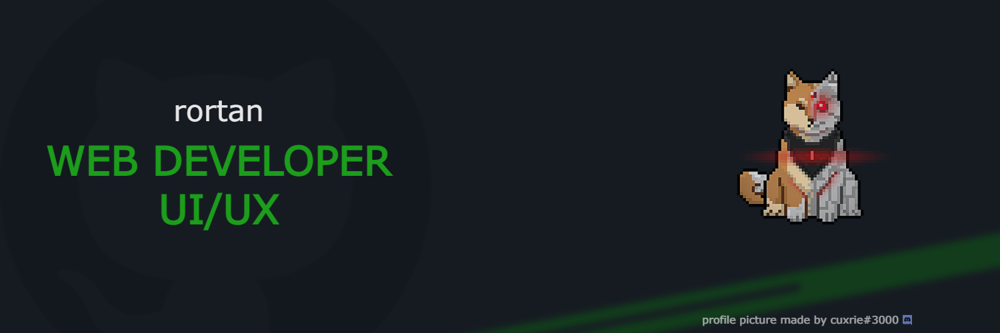

<h2>
Hey

</h2>
  
### 🚀 Currently working with:
- Nextjs / Reactjs
- Node & Express
- SEO

#### Also looking to collaborate on more open source projects 😉
- 📫 How to reach me <a href="mailto:gilbertojr.dev@gmail.com">gilbertojr.dev@gmail.com</a>

### Languages and Tools:

                

 

### 📊 Stats:

&nbsp;

  
 
                                                                                                              
